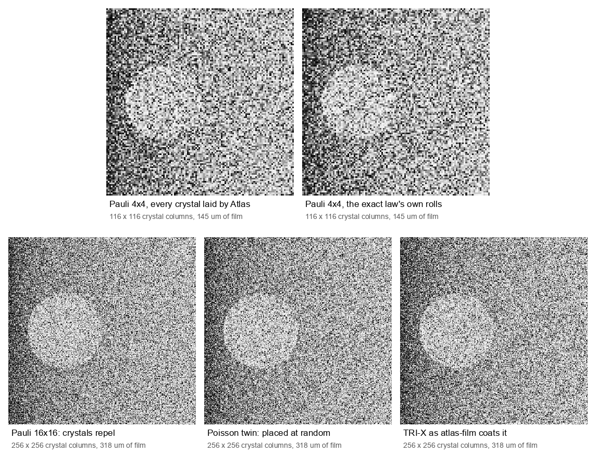
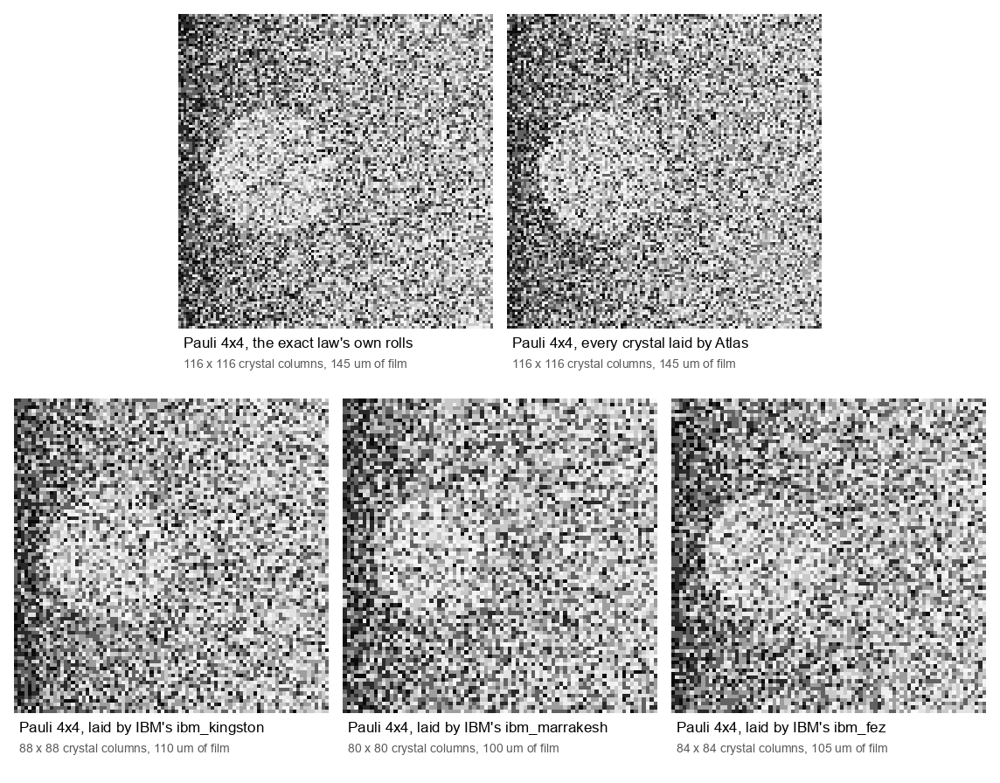
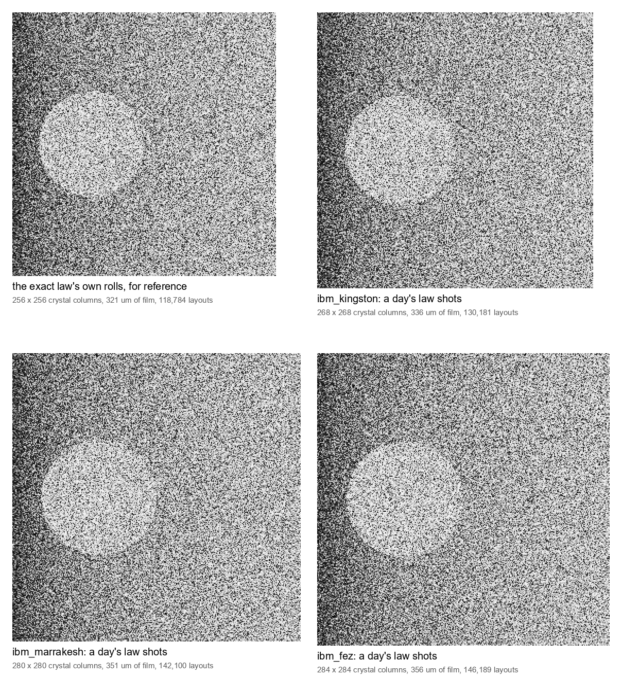
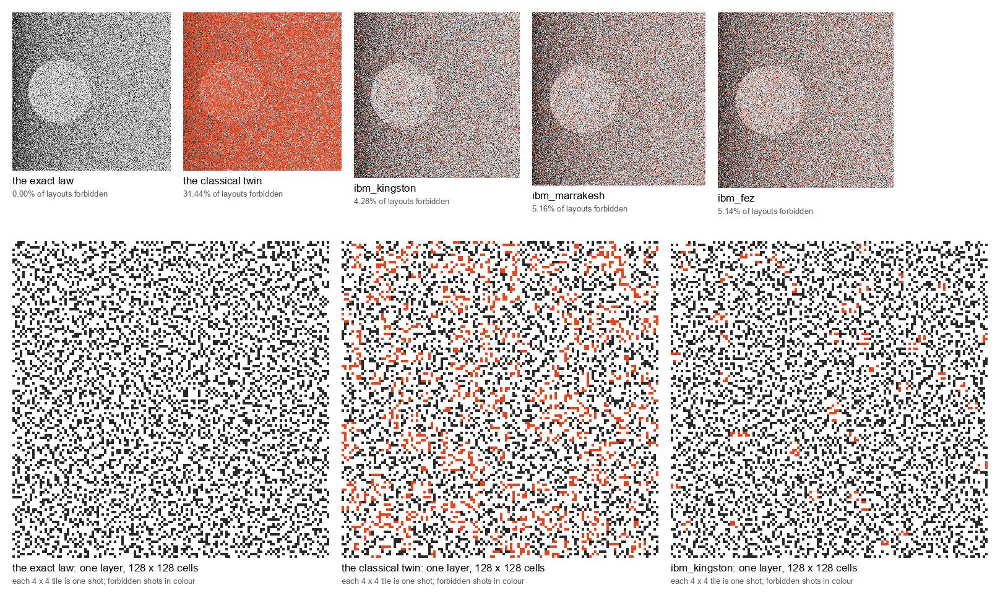
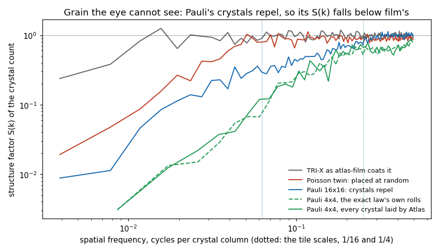

# Quantum-Film

**Film stocks whose crystals are laid by quantum circuits, and a fixer that
makes every print of a roll the same, bit for bit, on every machine.**

A roll of film is chance made permanent. Silver-halide crystals land where they
land, and the fixer bath locks the image in. This project makes both halves
literal:

- a quantum measurement lays the crystals, under the Born rule, which no
  machine can repeat;
- the fixer writes the roll down as integers with its provenance;
- everything after that is arithmetic that gets the same answer everywhere.

The stocks are meant to behave in ways real film never has, while staying
physically plausible. Each stock's crystal layout is the measurement
statistics of a quantum state a circuit can prepare, and its tone curve and
grain scale are borrowed from a real stock in
[atlas-film](https://github.com/loganw234/atlas-film), so only the placement
of the crystals is new.

| stock | what lays the crystals | how its grain differs from real film | status |
|---|---|---|---|
| **Pauli** | free fermions filling a Fermi disc: a determinantal point process | crystals repel; the grain is hyperuniform, with its structure factor falling to zero at low frequency | on the shelf: golden sampler; a binary64 sampler on libcft that lays golden's roll; a hardware-shaped circuit whose law ran on Atlas and holds; printed, with one print laid entirely by Atlas; run on three IBM QPUs, which carry its exclusion and its coherence |
| **Poisson** | uniform placement at the same density | none: the classical reference every other stock is measured against | on the shelf |
| **Speckle** | Born-rule shots of a random pupil through a 2D quantum Fourier transform | crystals bunch; the grain's contrast equals the fidelity of the machine that exposed it | planned |

## The first prints



**Top left: every crystal in this print was laid by a quantum circuit on Moth's
Atlas** (2026-09-26).
- It holds 24,389 shots of pauli-4x4's hardware-shaped circuit, from six Atlas
  jobs, stacked 29 layers deep in 29 x 29 tiles.
- It was developed at the density of TRI-X, as atlas-film models it, in
  atlas-film's pinned mode, then printed on silver paper.
- Beside it is the same law from its exact sampler.

The bottom row shows three stocks at the same density and pitch, 256 x 256
columns each:
- **Pauli**, whose crystals repel;
- **its Poisson twin**, the same count per tile placed at random;
- **TRI-X** as atlas-film coats it.

Each pixel is one column of crystals through the emulsion, 1.24-1.25 um across,
so each print is a fraction of a millimetre of film seen crystal by crystal.



**The bottom row was laid by three IBM quantum computers** (2026-10-05):
ibm_kingston, ibm_marrakesh and ibm_fez, running the same circuit as Atlas.
- Each print takes only its device's shots that kept exactly five crystals:
  14,979, 12,743 and 13,051 of 24,576. Of those, as many as fill whole
  tiles are laid (14,036, 11,600 and 12,789), and the rest are counted as
  left over in the print's record.
- The pre-registration fixed the print rule before any job ran: canonical
  order, shuffled on the print's own stream, 29 layers deep.
- Fewer shots make smaller pieces of film, 22, 20 and 21 tiles across against
  Atlas's 29.
- **The figure scales every panel to one width, so the IBM prints' grain
  looks coarser here than it is.** Each panel's label gives its true size.
- What the grain cannot show, the tables in
  [docs/HARDWARE-RESULTS.md](docs/HARDWARE-RESULTS.md) measure: 4.3% to 5.4%
  of those shots sit on layouts the law forbids.



**Then a sheet from each device** (2026-10-05, the same day). Each device ran
8 or 10 more of the same law jobs, and each sheet pools every five-crystal shot
of that device's day.

| device | five-crystal shots | sheet |
|---|---|---|
| kingston | 131,765 | 268 crystal columns |
| marrakesh | 142,381 | 280 crystal columns |
| fez | 147,047 | 284 crystal columns |

- Top left, for reference, is the exact law's own rolls at 256 columns.
- All four are drawn at one scale.
- **The sheets look alike, and alike to the reference.** The eye cannot see
  that 4.3% to 5.2% of the hardware's five-crystal shots are layouts the law
  forbids.
- [docs/HARDWARE-RESULTS.md](docs/HARDWARE-RESULTS.md) measures that, job by
  job. It also measures the drift: each device's five-crystal share moved
  between jobs by 9 to 13 times one job's sampling error.



**What the quantum hardware got right, in colour.** This is exploratory: it was
added after the pre-registration, at the owner's suggestion.
- **The law forbids clumps.** Of the 4,368 ways to place five crystals on a
  tile, the exact law forbids 1,360.
  - Every layout with five neighbouring pairs is among them; the most the law
    allows is four.
  - Its layouts average exactly 2 neighbouring pairs, and the forbidden ones
    3.11.
- **Top: each print with its forbidden crystals in colour.** Each crystal
  column is tinted by twice the share of its crystals that came from a
  forbidden layout.
  - The exact law's own rolls never land on one: 0 of 118,784.
  - The classical twin, five sites at random, lands on one 31.4% of the time,
    and its print turns red.
  - The IBM devices landed on one 4.3% to 5.2% of the time. Those shots are the
    devices' errors; the scarcity of colour is the quantum effect.
- **Bottom: one layer of three of the sheets, shot by shot.** Each 4 x 4 tile is
  one shot, and the forbidden ones are in colour.
  - kingston's forbidden shots average 3.01 neighbouring pairs, against 2.05 for
    its allowed ones: its errors bring back some of the clumps the law forbids.
  - In the summed print they are close to invisible, which is why the top row
    tints them.

`python tools/first_prints.py --forbidden` makes each overlay. It re-lays the
committed print's own layouts, holds its crystal counts and its print digest to
the committed record, and saves every number above in
[docs/prints/forbidden.json](docs/prints/forbidden.json).



**The grain differs where the eye cannot see it.**
- Between a Pauli tile's scale and its Fermi scale (k = 16 to 45 on the
  256-column sheets), Pauli's crystal count carries on average 0.47 of the
  noise power of film's random coating, and at most 0.64.
- The Poisson twin averages 0.89 there, and TRI-X 1.00.
- Every Pauli bin in that band lies below every twin bin.
- The exact law expects 0.30-0.64 for Pauli.
- Below the tile scale both are suppressed, the Poisson twin included: the
  fixed count per tile does that. Pauli still sits below its twin there, at
  about 0.4 of it in law. A bunched law could instead be enhanced there
  (docs/STOCKS.md).
- The Atlas-laid sheet and its exact twin trace the same curve.

**Each print is a function of its record.** Each one's record in
[docs/prints/](docs/prints/) names:
- its rolls, the mapping and the pitch;
- the scene and both exposures;
- the digests of the sheet, the negative and the print.

`python tools/first_prints.py --check` re-develops each print bit for bit.

## The web demo, the video and the poster

- **The web demo**, live at
  [loganw234.github.io/Quantum-Film](https://loganw234.github.io/Quantum-Film/),
  is the static page in site/. It holds:
  - an animated story of how film grain forms, classically and on Atlas;
  - A|B sliders over classical and quantum crystals and prints;
  - a tile you roll crystal by crystal, to watch the Pauli exclusion hole
    open.

  GitHub Actions deploys it on every push that changes it. Locally:
  `python -m http.server -d site`.
- **The video** is that story, recorded. Its Record button saves the canvas,
  captions included. For a screen recorder, open it as `?solo&play`: the stage
  alone, filling the window, playing on its own.
- **The poster** is [docs/prints/poster.png](docs/prints/poster.png): three real
  prints on a strip of film (tools/poster.py).
- **The paper**, *Chance, made permanent*, is
  [docs/chance-made-permanent.pdf](docs/chance-made-permanent.pdf): the law, the
  circuit on Atlas, the fixer, the prints and what comes next (a whole frame,
  colour, a quantum hand on the response). It was built with storydocs, which
  recomputes every number it states from this repository.

## What has been measured

Every figure below has a dated entry in [docs/VALIDATION.md](docs/VALIDATION.md).

- **The shelf's Pauli law ran on three IBM Quantum QPUs** (2026-10-05):
  ibm_kingston, ibm_marrakesh and ibm_fez, Heron r2, on the owner's free
  Open plan. It was pre-registered in
  [docs/PREREGISTRATION.md](docs/PREREGISTRATION.md) and is reported in full
  in [docs/HARDWARE-RESULTS.md](docs/HARDWARE-RESULTS.md).
  - **Exclusion:** of the shots that kept five crystals, 4.3% to 5.4% landed
    on layouts the law forbids, against 31.1% for the classical twin.
  - **Coherence:** ⟨X0X1⟩ and ⟨Y0Y1⟩ came out at +0.27 to +0.34, 18 to 23
    standard errors from the 0 a classical mixture gives. The law's is +0.375.
  - **Fidelity:** linear XEB +0.81 to +0.85, where the twin scores 0 and the
    law 1.
  - **Against the predictions:** every device fell short of its own noise
    model, which predicted XEB +0.92 to +0.94 and 2.2% to 2.7% forbidden.
  - **The runs:**
    - nine jobs, each submitted once;
    - each job's line committed and pushed before any result was read;
    - the known answer held on every device;
    - 45 QPU-seconds of the 600 the plan allows.
- **The shelf's Pauli law ran on Moth's Atlas emulator, and holds**
  (2026-09-25, job 8586f1cc).
  - **The circuit:** `givens_line.py`, 51 Givens rotations in 15 layers on
    the qubit line, 102 CNOTs. Its QASM has SHA-256 `ed767c01bd4b851d...`.
  - **The layouts:** 4,096 whole crystal layouts, every one of 5 crystals.
  - **Against the exact law:**
    - one-site frequencies within 1.48 standard errors, and all 120 pair
      frequencies within 2.52 (chi^2 112.3 over 120);
    - the whole distribution over the tile's symmetry orbits, chi^2 33.7 on
      33 degrees of freedom;
    - none of the 1,360 layouts the law forbids appeared.
  - **Coherence:** the engine's own <XX> and <YY> on two sites, 0.3755 and
    0.3687, match the exact 0.375.
  - **The records:** 1,995 device rolls, each bound to a commitment committed
    to git before the job's first status call. That ordering rests on the
    code and the local clock.
  - **Five more jobs** ran on 2026-09-26, for the Atlas print. Pooled with
    the first, that is 24,576 shots:
    - one-site max |z| 2.15 and pairs 2.64 against the exact law;
    - 3,004 of the law's 3,008 allowed layouts seen, and no forbidden one;
    - 12,071 device rolls, each with its commitment.
- **A fermion tile of this project's own ran on Moth's Atlas emulator**
  (2026-09-25). It had 16 qubits, 5 fermions and 256 CNOTs, and returned
  4,096 whole crystal layouts:
  - every layout held exactly 5 crystals;
  - all 120 site-pair statistics fell within 2.21 standard errors of that
    tile's exact law.

  Reading the samples needed a count order the platform does not document;
  it was decoded against known answers.
  - **That tile was a research prototype, not the shelf's Pauli law.** It
    filled the standing waves of an open box, not the Fermi disc of a
    periodic tile. The shelf's law ran later the same day (above).
  - This README first said otherwise, and so did four other documents.
    The P0 verifier caught it. Against the shelf's law, the same data
    score 20 standard errors off.
- **The three statistics are distinct at equal density** (2026-09-25). This
  was a classical simulation of the quantum laws, not hardware:

  | measure | fermionic | Poisson | speckle |
  |---|---|---|---|
  | nearest-neighbour pair correlation | 0.47 | 1.02 | 1.73 |
  | print-scale RMS on one shared scale, first layout only (grey levels) | 5.70 | 9.45 | 16.73 |

- **Arithmetic decides a roll unless it is pinned** (2026-09-25). On a
  32x32 research tile with 128 crystals, the same random numbers were run at
  binary32, and 2 of 40 fermion films parted from the binary64 reference.
  From the first differing draw on, they shared only 55–86% of their
  crystals. On the shelf's own stocks no random roll parted at any format:
  binary32 on 5,800 rolls, binary64 and binary128 on 2,300. Random targets
  came no closer to a boundary than about 1e-6 of the weight left to draw. A
  target planted inside a format's own error parts that format's roll.
- **The authority's rolls do not depend on its arithmetic.** A draw closer
  than 2^-224 to a boundary is refused, not decided. The 256-bit error in
  every target and boundary is at most 2^-249.2. It was measured draw by draw
  against references that share none of the authority's code: exact
  Fractions on pauli-4x4, whose kernel is rational, and an independent chain
  rule at 512 bits on the 16x16 stock.
- **A binary64 sampler on libcft lays the authority's roll** (2026-09-26,
  `quantum_film/pinned`). It encloses the exact chain rule by directed
  rounding, and decides a draw only when the target clears every boundary by
  2^-200. A roll with any draw it cannot decide goes whole to the authority.
  - 2,300 pauli-4x4 and 740 pauli rolls equal the authority's, and none was
    handed off.
  - With the hand-off removed, a target planted inside binary64's own error
    parts from the authority, as it must.
  - On the 16x16 stock it takes 0.62x the authority's time.
  - Equality with the authority could not see a faulty certificate: 10 of 11
    planted faults passed it. Each step is held to exact arithmetic instead.
- **Identical requests to Atlas returned different bytes wherever sampling
  was involved**, seeded engines included; a seed fixes the circuit, not
  the shots.

## What it is not

- **Not a quantum advantage.** At these sizes both quantum laws are classically
  simulable. That is exactly what makes them checkable. "Quantum" here means
  the crystals were laid by coherent interference, verified against the exact
  law.
- **Not deterministic at the shot.** A roll from a device is unique. The fixer
  records it, and nothing reproduces it. What is deterministic is everything
  downstream of the record, and every emulated roll.
- **Not on hardware yet.** The Atlas account used here has no QPU access.
  Hardware runs are planned on IBM's free Open Plan.
- **Not a model of any real film's grain.** Poisson is the reference; Pauli and
  Speckle are the point.

## How the claims are checked

One command, in two sizes:

```bash
make verify-quick   # ~65 s: lint, docs, vectors, golden, circuits, decode, client, fixer, pinned, develop, the control and its twin
make verify         # adds the cft and live-Atlas stages; pinned and cft skip BY NAME without libcft, Atlas without a key
bash verify/run.sh --list
```

- **The authority** is `quantum_film/golden`: pure Python and mpmath at 256
  bits, with exact counter-based uniforms (SHA-256). It imports nothing it
  could share with what it judges; a test holds that mechanically. The
  circuits, the float paths and Atlas's results are all scored against it.
- **Refusals.** A draw that rounding could decide is refused by name, and so
  is a record whose bytes or law have changed.
- **The pinned path is held step by step.** Each directed operation is held
  to its exact floor or ceiling. Each certificate step is held to exact
  rationals on tight inputs, where flipping any directed call fails it. The
  decision the sampler draws from is held to the exact chain rule's, with
  targets planted either side of every boundary. What its source rule cannot
  see is stated in `quantum_film/pinned/certificate.py`.
- **The negative control, and its twin.** Every run feeds the fixer's own
  command line a record with one crystal moved. If the fixer accepts it, or
  refuses it for any reason but its digest, the run fails. The twin feeds it
  the genuine records, which it must accept, because a command line that
  refused everything would pass the control alone.
- **Gates are held to planted faults.** Among them: a sampler bug, a shrunken
  margin, a moved crystal, a re-attributed job, a skipped test, a stale path.
  The P0 verifier found gates that could not fail, and a runner that could
  report PASSED over a failure. docs/VALIDATION.md records each, and what now
  makes it fail.

What is promised, and what is not, is written down once, in
[docs/DETERMINISM.md](docs/DETERMINISM.md).

## Layout

```
quantum_film/stocks.py     the shelf: every stock's parameters, in one table
quantum_film/golden/       the authority: exact uniforms, the Pauli and Poisson laws
quantum_film/pinned/       the Pauli law in binary64 on libcft: the authority's roll, certified or handed off whole
quantum_film/develop.py    rolls laid as a sheet of film, developed and printed through atlas-film's pinned mode
quantum_film/circuits/     the Pauli law as a Givens circuit (float64, independent of golden)
quantum_film/atlas/        the Atlas client (key kept outside the tree) and the count-order rule
quantum_film/fixer.py      negative records: fix, check from the record alone, reproduce
verify/                    the runner: make verify-quick / make verify
tools/                     the vector generator, the Atlas run, the first prints and their figures, the smoke checks
tests/, tests/vectors/     the gates, and the frozen vectors they replay
docs/                      one file per subject; docs/README.md is the index; docs/prints/ holds the first prints
research/2026-09-25/       the day of exploration the project started from, kept as run
vendor/cft-fp256           the pinned-arithmetic library, a submodule at 7d7285d
vendor/atlas-film          the medium, a submodule at d4007b2 (its pinned branch)
```

## Moth Hack 2026

Entered for the Expert challenge #9: a repository of a quantum application that
runs a process on media through the Atlas API. **By its owner's intent this
entry is not a candidate for cash prizes.** It was built by Logan W. together
with AI collaborators (Claude Opus 5.5 and the agents it directed), who are
credited here as contributors equal to the human one; every commit carries its
co-author line.

## Neighbours

- [atlas-film](https://github.com/loganw234/atlas-film): the medium; the
  sourced organs development borrows.
- [cft-fp256](https://github.com/loganw234/cft-fp256): deterministic IEEE 754
  arithmetic, and the pinned path for development.
- [atlas-engine](https://github.com/loganw234/atlas-engine): the same
  discipline on GPUs, one hash across vendors.
- The methods it is built under:
  [HonestFramework](https://github.com/loganw234/HonestFramework) and
  [ParcelRound](https://github.com/loganw234/ParcelRound).

## Licence

MIT ([LICENSE](LICENSE)). cft-fp256 is Apache-2.0 and is pinned as a
submodule; [THIRD_PARTY_NOTICES.md](THIRD_PARTY_NOTICES.md) carries its
NOTICE and lists every other dependency's licence.
